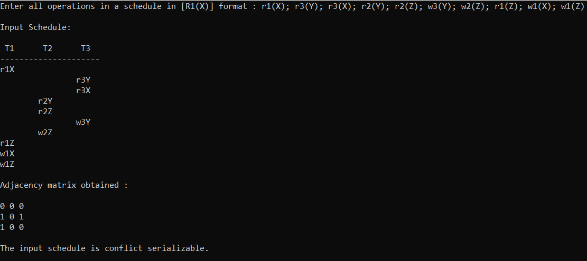
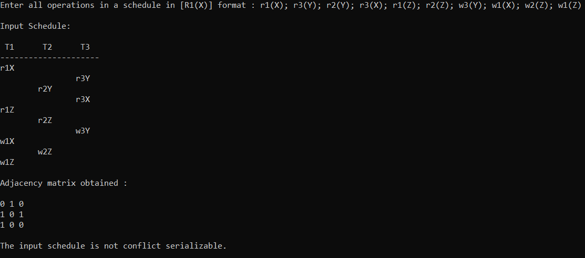

# Conflict Serializability Checker

 

## What is Conflict Serializabilty?
When working with database systems, transactions amount to a major role. In order to preserve ACID properties and in particular consistency and isolation with concurrent transactions in a non=serial schedule, a concept called conflict serializability is used. It essentially states that if a non-serial schedule can be converted or simply viewed as a serial schedule we can infer that the schedule will maintain database consistency since a serial schedule always leads to a consistent database.

 

## The Idea
Since when working with multiple transactions, there are numerous ways in which a non-serial schedule can modified by swapping conclicting instructions. Thus to reduce this redundant computation, we instead use precedence graphs i.e. directed graphs that map the universal rules for execution of differnt transactions and their operations in the schedule. The edges are computed in a precedence graph based on how different operations on the same database items behave when executed in a particular order. In order to check if the schedule is conflict serializable or not, we then use a cycle detections algorithm on the obtained graph. On absense of cycles, we can conclude that a non-serial chedule is conflict serializable.

 

## The Implementation
This is a simple implementation in C++ of the theoretical idea above. The program takes input of all operations in a single line and preprocesses it to obtains all the operations in execution order without the user having to explicitly provide extra parameters like number of transactions or databse items. A precedence graph is generated using dynamic memory and the graph is then traversed using Depth-First Traversal obtaining DFS Trees in the process which are then inspected for any back edges that can lead to formation of cycles. Appropriate information is also printed to help visualize the process better.

 

## Sample Outputs

 

